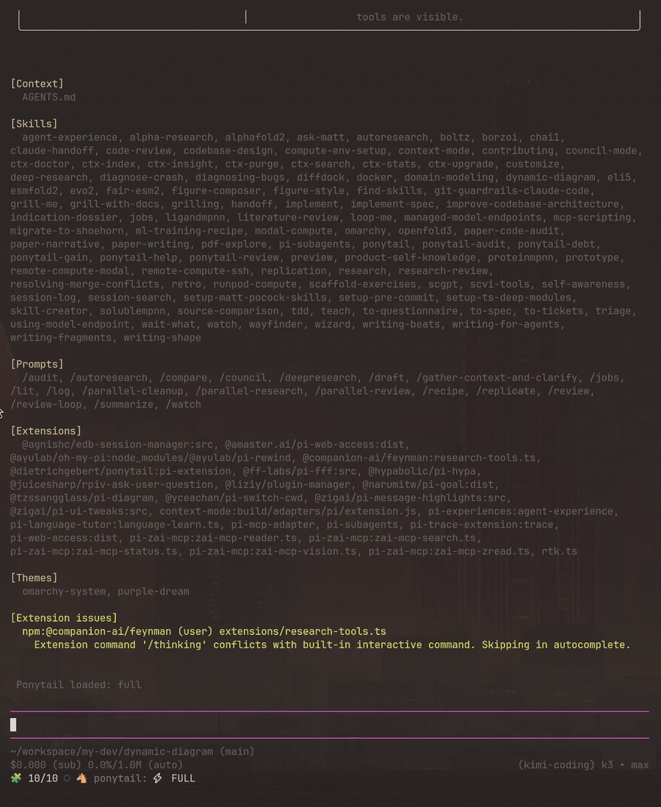

# pi-diagram

pi extension that renders **architecture / data-flow / runtime diagrams inline
in the transcript**, from a declarative JSON spec the LLM writes.

Built on the [dynamic-diagram](https://github.com/tzssangglass/dynamic-diagram) engine: rendering runs in a
short-lived child process. Generation is asynchronous and cancellable; inline
playback retains frame bytes in a bounded cache in pi. Time and memory depend
on scene size, raster density and frame count.



*Recorded live in pi: one English prompt → the LLM writes the spec → the
engine renders → the animation plays inline. Full loop in 44s.*

## What it adds to pi

- **`diagram` tool** — the LLM writes a JSON spec (nodes, icons, links, flying
  packets), the tool renders a site-grade image inline. `search_icons` param
  searches the 11,831-icon catalog.
- **`/diagram [name]`** — list rendered diagrams; `/diagram <name>` opens one
  fullscreen (kitty-protocol image).
- **Inline animation** — pass `animate: true` with a positive spec `duration`.
  Frames follow the requested `fps` (default 24), capped at 240 per loop. The
  full authored duration is preserved and playback follows elapsed time.
  Omitting `animate` or setting it to false returns a static image.
- **Adaptive presentation** — inline animation uses the engine's presentation
  factor within the host's available columns (default 75% with the current
  engine). The factor comes from the frame manifest, independently of PNG
  density. Engine `canvas.min_height` adds room and `canvas.scale` multiplies
  the complete image's new baseline. Pi's native static-image viewer controls
  its own viewport fitting. `layout: "flow"`, `"grid"`, or `"columns"` places nodes
  without coordinates; see the engine spec reference for the object form.

## Requirements

- The engine binary. `npm install` fetches a prebuilt binary from
  [dynamic-diagram GitHub Releases](https://github.com/tzssangglass/dynamic-diagram/releases)
  into `vendor/bin/` via postinstall and **verifies its minisign signature**
  (Ed25519; pubkey pinned below) before installing — skip with
  `PI_DIAGRAM_SKIP_DOWNLOAD=1`.
  Resolution order: `DYNAMIC_DIAGRAM_BIN` → vendored binary → `PATH`.
  Manual alternatives:
  ```sh
  cargo binstall dynamic-diagram   # prebuilt binary via crates.io metadata
  # or build from source:
  cd dynamic-diagram && cargo build --release
  export DYNAMIC_DIAGRAM_BIN=$PWD/target/release/dynamic-diagram
  ```

> **Inline animations need pi's fullscreen TUI mode.** Set
> `"tuiMode": "fullscreen"` in `~/.pi/agent/settings.json` (or start with
> `pi --tui-mode fullscreen`). In pi's default `regular` mode every animation
> tick triggers a full repaint that emits `ESC[3J` (ED3), erasing the
> terminal's scrollback and pinning the view to the bottom — scrolling becomes
> impossible while playing. In fullscreen mode the transcript is a real
> ScrollView with follow-suppression: manual scroll disables auto-follow and
> scrolling stays alive during playback.

## Install

As a pi package from npm (postinstall downloads the engine automatically):

```sh
pi install npm:@tzssangglass/pi-diagram
```

As a pi package (from a checkout):

```sh
pi install /path/to/pi-diagram
```

Or for development (hot-reloadable with `/reload`):

```sh
ln -s /path/to/pi-diagram/extensions/index.ts ~/.pi/agent/extensions/pi-diagram.ts
```

## Env

| var | meaning |
|-----|---------|
| `DYNAMIC_DIAGRAM_BIN` | path to the engine binary (default: vendored download, else `dynamic-diagram` from `PATH`) |
| `PI_DIAGRAM_SKIP_DOWNLOAD` | skip the postinstall engine download |
| `PI_DIAGRAM_ENGINE_BASE_URL` | override the engine download base URL (mirror/testing) |
| `DD_ANIM_SCALE` | animation raster density, default `2`; independent of `canvas.scale` |
| `DD_ANIM_CACHE_BYTES` | total cached base64 frame bytes, default 16 MiB |
| `DD_DIAGRAM_TIMEOUT_MS` | static rendering/icon search timeout, default 30000 ms |
| `DD_ANIM_TIMEOUT_MS` | animation generation timeout, default 60000 ms |
| `DDA_SCALE` | engine static raster density, default `3` |

Specs and posters are saved as `<cwd>/.diagrams/<name>.{json,png}`. Each
animation uses a unique temporary directory and reads the engine's
`frames.json` manifest. The first frame also becomes the saved poster; it
does not require another render. Session shutdown cancels active generation,
stops playback timers and removes owned temporary exports. Reopened history
can show the saved poster when its temporary frames are gone.

The cache and active animation count (12) are bounded. A single scheduler
invalidates recently rendered images; hidden/offscreen rows stop scheduling
after an idle grace period. Uncached frame reads and terminal transfer still
cost time. Static image sizing is handled by pi's native image renderer.

After updating a development checkout, rebuild the engine and use `/reload`
in pi to load the extension changes.

## Test

```sh
npm test   # public tool behavior using a fake child engine
DYNAMIC_DIAGRAM_TEST_BIN=/path/to/dynamic-diagram npm test  # also use the real engine
```

The spec format is documented in the tool description itself; the full
reference and an authoring skill for AI agents live in the
[dynamic-diagram](https://github.com/tzssangglass/dynamic-diagram) repo
(`skills/dynamic-diagram/SKILL.md`, printable anywhere with `dynamic-diagram skill`).
